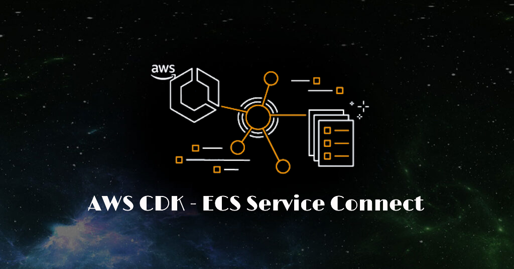

<p align="center">
  <a href="https://dev.to/vumdao">
    
  </a>
</p>
<h1 align="center">
  <div><b>ECS service-to-service communication</b></div>
</h1>

## Abstract
- **Interconnect Amazon ECS services**: Applications that run in Amazon ECS tasks often need to connect to other applications that run in Amazon ECS services. If you need an application to connect to other applications that run in Amazon ECS services, Amazon ECS provides the following ways to do this without a load balancer:
  - [Amazon ECS Service Connect](https://docs.aws.amazon.com/AmazonECS/latest/developerguide/service-connect.html)
  - [Amazon ECS service discovery](https://docs.aws.amazon.com/AmazonECS/latest/developerguide/service-discovery.html)

## Table Of Contents
* [Amazon ECS Service Connect](#Amazon-ECS-Service-Connect)
* [AWS ECS Service Connect vs Service Discovery](#AWS-ECS-Service-Connect-vs-Service-Discovery)
* [Deploying Sample Yelb Application for service connect with Amazon ECS and AWS CDK Typescript](#Deploying-Sample-Yelb-Application-for-service-connect-with-Amazon-ECS-and-AWS-CDK-Typescript)
* [Walkthrough](#Walkthrough)
* [Cleaning up](#Cleaning-up)
* [Conclusion](#Conclusion)

---

## 🚀 Amazon ECS Service Connect <a name="Amazon-ECS-Service-Connect"></a>
- Amazon ECS Service Connect enables easy communication between microservices and across Amazon Virtual Private Clouds (Amazon VPCs) by leveraging AWS Cloud Map namespaces and logical service names. This allows you to seamlessly distribute traffic between your Amazon ECS tasks without having to deploy, configure, and maintain load balancers.
- We recommend Service Connect, which provides Amazon ECS configuration for service discovery, connectivity, and traffic monitoring. With Service Connect, your applications can use short names and standard ports to connect to Amazon ECS services in the same cluster, other clusters, including across VPCs in the same AWS Region

  

## 🚀 AWS ECS Service Connect vs Service Discovery <a name="AWS-ECS-Service-Connect-vs-Service-Discovery"></a>
- Service Connect offers a significant advantage over plain Cloud Map for service discovery by providing faster failover when service instances go down. With DNS-based lookup in Cloud Map, the client may take some time (depending on the TTL settings) to recognize that it needs a new IP address when a service goes down. This delay can be exacerbated if the client library caches the same IP address for an extended period, or if the client's retry logic repeatedly attempts to connect to the same IP address after a failure.
- Service Connect, on the other hand, introduces a sidecar "proxy" container that intercepts outgoing connections and routes them to the correct destinations. Instead of relying on potentially stale DNS entries, the sidecar uses API calls to Cloud Map to look up the IP address of a healthy service instance in real-time. This method provides the standard benefits of a service mesh, like Envoy, with the added advantage that Service Connect manages the sidecar for you. For a more detailed discussion of these benefits, see the guide on migrating existing Amazon ECS services from service discovery to Amazon ECS Service Connect.
- Since Service Connect doesn't rely on DNS, it avoids registering even private DNS entries. Instead, it registers endpoints with Cloud Map that are privately discoverable only through API calls. There currently appears to be no option to configure Service Connect to register service names in DNS.

## 🚀 Deploying Sample Yelb Application for service connect with Amazon ECS and AWS CDK Typescript <a name="Deploying-Sample-Yelb-Application-for-service-connect-with-Amazon-ECS-and-AWS-CDK-Typescript"></a>
- The Yelb application used in this demo was adapated from Massimo Re Ferrè's original application [here](https://github.com/mreferre/yelb).

  

  ### 📖 **Solution overview**

  

  ### 📖 CDK Stacks

  

## 🚀 Walkthrough <a name="Walkthrough"></a>
- Prerequisites: For this walkthrough, you’ll need the following prerequisites
  - AWS account
  - AWS CDK CLI
  - CDK bootstrap on the target region
  - [Projen](https://projen.io) - Configuration management
  - [pNpm](https://pnpm.io) - Fast, disk space efficient package manager

1. Initial setup
```
# Clone project sample
git clone git@github.com:vumdao/ecs-service-connect-cdk.git && cd ecs-service-connect-cdk

# Install node modules
pnpm install

# Update your AWS account in `src/lib/shared/constants.ts` at `CDK_DEFAULT_ACCOUNT` and target region in `src/lib/shared/environment.ts` at `devEnv`
sed -i 's/107858015234/234567890123/g' src/lib/shared/constants.ts
sed -i 's/region: .*,/region: "us-west-2",/g' src/lib/shared/environment.ts

# Update Hosted zone name and zone ID in `src/lib/shared/constants.ts` with yours AWS hosted zone to create domain for yelb application eg. yelb.simflexcloud.com
# export const SIMFLEXCLOUD_ZONE_NAME = 'simflexcloud.com';
# export const SIMFLEXCLOUD_ZONE_ID = 'ZZZZZZZSSSSSSAAAA';

# Get CDK stack
cdk ls

# Deploy CDK
cdk deploy EcsBlueprintsStack --require-approval never
```

2. Explore created resources
  - Cloudformation Stack

    

  - ECS Cluster

    

  - Yelb database with client service connect

    

  - Yelb redis with client service connect

    

  - Yelb appserver with client and api-call service connect

    

  - Yelb appserver task with service-connect side-car (this agent is required for all services which enabled service connect)

    

  - appserver autoscaling group with CPU Utilization track

    

  - Yelb UI with client service connect

    

  - Application load balancer to forward requests to yelb-ui target group

    

  - Target group of yelb-ui

    

  - Cloud map service with namespace used by ECS service connect

    

  - Cloud map namespace

    

## 🚀 Cleaning up <a name="Cleaning-up"></a>
- To avoid charges, clean up the resources created in this post by running `cdk destroy` or go to cloudformation and delete the stack

  

## 🚀 Conclusion <a name="Conclusion"></a>
- With this walkthrough, you can easily deploy ecs-service-connect-yelb-sample-app using AWS CDK typescript to demonstrate ECS service-to-service communication using ECS service connect
- Cloudmap creates private hosted zone automatically when creating namespace, we can delete it as we don't rely on private hosted zone when using service connect
- Regarding the pricing for ECS Service Connect, AWS Cloud Map usage is entirely free when utilised by Service Connect. This includes service discovery, connectivity, and telemetry generated within the ECS console and CloudWatch by Service Connect. The only charges incurred are for the compute resources utilised. ECS Service Connect introduces a new container (Service Connect proxy) to each new task upon initiation. Consequently, you are only billed for the CPU and memory allocated to this sidecar proxy container.

---

## References
- https://github.com/aws-samples/ecs-service-connect-yelb-sample-app
- https://aws.amazon.com/blogs/containers/proactive-scaling-of-amazon-ecs-services-using-amazon-ecs-service-connect-metrics/
- https://github.com/mreferre/yelb